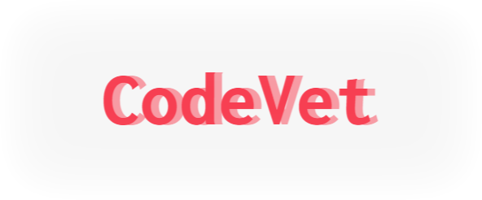

<p align="center">
  <a href="/">
    
</a>
<h3 align="center">Open-source LLM Powered Code Review Tool</h3>
<p align="center">
  <a href="/">
    
  </a>
  <a href="/">
    
  </a>
</p>

# CodeVet

CodeVet is an LLM-powered git pull request review tool for Gitea and GitHub. It supports OpenAI and self-hosted OpenAI-compatible servers like [llama-cpp-python](https://github.com/abetlen/llama-cpp-python). Additionally, it now supports Google's Gemini models with OpenAI compatibility.

### Working

This tool uses webhooks of Gitea/GitHub. Once a webhook is triggered on a 'Pull Request' event, this tool fetches the git diff of the opened pull request and sends it to the LLM for reviewing. Once the LLM returns the review, this tool posts that review to Gitea/GitHub as a comment on the pull request. If there is any failure, a generic error message is posted to the pull request as a comment indicating the failure.

### Prerequisites

- Edit `config.ini` and change `modelAlias` to the name of the model you are using.
- Add the following environment variables to the `.env` file:
  - `GITHUB_ACCESS_TOKEN`: Your GitHub personal access token.
  - `GITEA_USER_TOKEN`: The base64 encoding of `username:password` for your Gitea account.
- Update the `baseUrl` for `GITEA` in `config.ini` to your Gitea instance URL.

### Usage

Build the container:
```bash
docker build -t codevet .
```
Run the container: (change `API_KEY` as per your OpenAI API key or Gemini API key)
```bash
docker run -d --name codevet -p 8001:8001 -v $PWD:/home -e UVICORN_HOST=0.0.0.0 -e API_KEY=sk-xxxx codevet
```

Once the container is running, create a webhook in your Gitea or GitHub repository for `http://<host-server>:8001/review`.

### OpenAI Compatible Models

> **Update** - Now Gemini models support OpenAI specifications (Experimental Support). You can use the free models for personal use. Visit [Gemini Docs](https://ai.google.dev/gemini-api/docs/openai) for usage information. All you need is an API key, base URL, and model name (e.g., for Gemini 2.0 Flash, use `gemini-2.0-flash`).

If you prefer using self-hosted models, you can use any OpenAI-compatible server like [llama-cpp-python](https://github.com/abetlen/llama-cpp-python).

> **Check out my other repo [llm-server](https://github.com/darshpanchal/llm-server), a dockerized OpenAI-compatible server based on [llama-cpp-python](https://github.com/abetlen/llama-cpp-python).**

Once you have deployed the server, modify `config.ini` and change the `baseUrl` (under `LLMCONFIG`) value to the server link.

### Limitations
- Currently, it only works on the `opened` event for pull requests.
- The provided user prompt for the LLM might not work for all models, so you can customize it according to the model you are using.
- The tool may be inaccurate if the git diff doesn't contain enough changes.

### Future Enhancements
- [ ] Support for GitLab.
- [ ] Support for other events like push and pull request updates.

### Libraries Used
- [fastapi](https://github.com/tiangolo/fastapi)
- [openai-python](https://github.com/openai/openai-python)
- [uvicorn](https://github.com/encode/uvicorn)
- [httpx](https://github.com/encode/httpx)

## Authors

- [@darshpanchal](https://www.github.com/darshpanchal)
